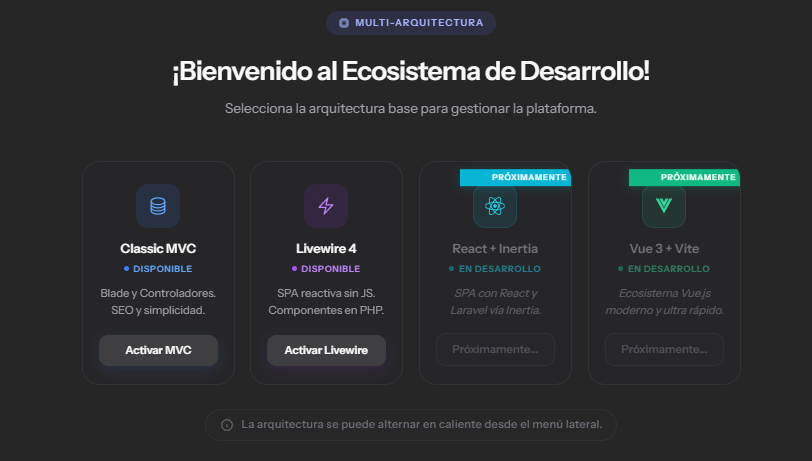

# Pair-Programming — Multi-Architecture Laboratory with Laravel

A reference project that demonstrates how multiple architectural patterns coexist within a single Laravel application, consuming the same database and sharing a common domain layer. The goal is to compare the strengths, differences, and workflows of each approach in practice, without the overhead of maintaining separate repositories.

**Project concept, architecture design, and implementation by the author.** This project was conceived as a hands-on demonstration of software engineering skills, including the ability to integrate multiple front-end technologies within the Laravel ecosystem, apply SOLID principles in a real codebase, and design scalable, maintainable structures from the ground up.



---

## Project level

This project sits at an **intermediate level** in terms of the domain it models (a book catalog), but applies **advanced architectural concepts** in its internal design. The decision to run four independent front-end architectures on top of a single shared domain layer — enforcing SRP through Services, DTOs, and FormRequests — goes beyond what most Laravel tutorials or starter kits cover. That said, there is significant room to grow: features like queues, events, caching strategies, API versioning, policies/gates, observers, and real-time broadcasting are not yet in scope. The architecture was designed precisely so that those features can be added incrementally without restructuring the project.

---

## Table of contents

1. [Overview](#overview)
2. [Tech stack](#tech-stack)
3. [Prerequisites](#prerequisites)
4. [Installation](#installation)
5. [Migrations and seeders](#migrations-and-seeders)
6. [Running the project](#running-the-project)
7. [Data model](#data-model)
8. [Single Responsibility Principle (SRP)](#single-responsibility-principle-srp)
9. [MVC architecture](#mvc-architecture)
10. [Livewire architecture (SFC)](#livewire-architecture-sfc)
11. [React + Inertia architecture (planned)](#react--inertia-architecture-planned)
12. [Vue 3 + API REST architecture (planned)](#vue-3--api-rest-architecture-planned)
13. [General flow across all four architectures](#general-flow-across-all-four-architectures)
14. [Mode selector](#mode-selector)
15. [Directory structure (target)](#directory-structure-target)
16. [Tests](#tests)
17. [Project conventions](#project-conventions)

---

## Overview

The application manages a catalog of **authors** and **books**, enriched with a **countries** catalog (flags included). On top of that domain, the following architectures are implemented — or planned:

| Architecture | Status | Description |
| --- | --- | --- |
| Traditional MVC | Implemented | Controllers under `Mvc/`, FormRequests, Blade views, classic HTTP redirects. |
| Livewire 4 (SFC) | Implemented | Reactive components with Livewire Forms, Volt, and Flux UI. No dedicated controllers. |
| React + Inertia | Planned | Controllers under `Inertia/` returning `Inertia::render()`. JSX components receive props directly from the server. No REST API required. |
| Vue 3 + API REST | Planned | Controllers under `Api/` exposing JSON endpoints. Vue consumes the API as a decoupled SPA with Vue Router and Axios. |

All architectures share the same **Models**, **Services**, **DTOs**, and **database**, putting the **Single Responsibility Principle (SRP)** from SOLID into practice.

---

## Tech stack

| Component | Version |
| --- | --- |
| PHP | >= 8.2 |
| Laravel Framework | 12.x |
| Livewire | 4.x |
| Livewire Flux | 2.9.x |
| Laravel Fortify | 1.30.x |
| Tailwind CSS | 4.x |
| Vite | 7.x |
| Database | SQLite (configurable) |
| Authentication | Fortify (login, registration, 2FA) |

---

## Prerequisites

- **PHP 8.2+** with the `sqlite3`, `mbstring`, `openssl`, and `pdo_sqlite` extensions.
- **Composer 2.x**
- **Node.js 18+** and **npm**
- **Git**

> On Windows, tools like [Laragon](https://laragon.org/) or [Herd](https://herd.laravel.com/) bundle all required dependencies out of the box.

---

## Installation

```bash
# 1. Clone the repository
git clone <repository-url> pair-programming
cd pair-programming

# 2. Install PHP dependencies
composer install

# 3. Set up the environment
cp .env.example .env
php artisan key:generate

# 4. Create the SQLite database (if it does not exist)
#    The file is already present at database/database.sqlite.
#    If you need to recreate it:
#    New-Item database/database.sqlite -ItemType File   # PowerShell
#    touch database/database.sqlite                     # Linux / macOS

# 5. Install front-end dependencies
npm install

# 6. Create the storage symlink
php artisan storage:link
```

---

## Migrations and seeders

### Running migrations

```bash
php artisan migrate
```

This creates the following domain tables (in addition to the framework's own tables):

| Table | Description |
| --- | --- |
| `countries` | Country catalog with common name, official name, ISO `cca3` code, and local flag paths (PNG/SVG). |
| `authors` | Authors with first name, last name, birth date, photo, and a foreign key to `countries`. Composite `unique` constraint on `(name, last_name)`. |
| `books` | Books with title, ISBN (unique, 13 characters), page count, and a foreign key to `authors`. |

### Running seeders

```bash
php artisan db:seed
```

The `DatabaseSeeder` runs in order:

1. **`UserSeeder`** — Creates a test admin user:
   - Email: `admin@admin.com`
   - Password: `12345`

2. **`CountrySeeder`** — Reads the file `database/data/countries.json` (a local source with no external dependency) and populates the `countries` table with names and flag paths already stored in `public/img/flags/`.

### Resetting everything from scratch

```bash
php artisan migrate:fresh --seed
```

---

## Running the project

The project includes a Composer script that starts the PHP server, the job queue, and the Vite dev server simultaneously:

```bash
composer dev
```

This runs in parallel:

| Process | Command |
| --- | --- |
| Web server | `php artisan serve` |
| Job queue | `php artisan queue:listen --tries=1` |
| Vite (assets) | `npm run dev` |

Once started, navigate to `http://localhost:8000` and log in with the seeder credentials.

> If you prefer to run each process manually, open three terminals and execute each command separately.

---

## Data model

The relationships between domain entities follow a normalized relational schema:

```
countries ──1────N── authors ──1────N── books
```

- A **country** has many authors.
- An **author** belongs to a country and has many books.
- A **book** belongs to an author.

These relationships are enforced at the database level via `foreignId()->constrained()` and at the Eloquent level with `belongsTo()` and `hasMany()` methods.

---

## Single Responsibility Principle (SRP)

The central architectural decision of the project is that **business logic lives neither in the Controllers nor in the Livewire components**. Instead, it is delegated to shared layers that any architecture can consume:

```
Controller / Livewire Component
        |
        v
   FormRequest / Livewire Form    <-- Validation
        |
        v
       DTO                        <-- Typed data transport
        |
        v
     Service                      <-- Business logic (coordination)
        |
        v
 Query Component                  <-- Modular query logic (tap/pipe)
        |
        v
      Model                       <-- Persistence (Eloquent)
```

### DTOs (`app/DTOs/`)

`readonly` classes that encapsulate validated data and transport it between layers without coupling them to the HTTP `Request` or the Livewire component.

- `AuthorData` — First name, last name, country, birth date, and photo path.
- `BookData` — Title, ISBN, page count, and author.
- `CountryData` — Common name, official name, CCA3 code, and flag URLs (used by the seeder).

### Services (`app/Services/`)

Contain the business logic and coordinate operations between the model and the file system.

- `AuthorService` — Create, update, and delete authors. Handles cleanup of previous photos on update and validates referential integrity before deletion (an author with associated books cannot be deleted).
- `BookService` — Book CRUD operations.
- `FileService` — Centralizes file upload and deletion across any storage disk. Ready to migrate from `public` to `s3` by changing a single environment variable.

### Query Components (`app/Scopes/`)

Modern approach introduced in **Laravel 12.x** to extract repeated query logic into reusable, invokable objects.

- `AuthorSearch` — Encapsulates the logic for searching authors by name or last name using `whereAny`.
- `BookSearch` — Handles complex book searching across title, ISBN, and the author relationship (`orWhereHas`).

These components are applied using the `tap()` method: `->tap(new AuthorSearch($term))`.

---

## MVC architecture

The classic Laravel pattern. User requests travel through the full cycle: Request, Route, Controller, View.

### Components

| Layer | Location | Responsibility |
| --- | --- | --- |
| Routes | `routes/web.php` (prefix `mvc/`) | Define RESTful routes with `Route::resource`. |
| Controllers | `app/Http/Controllers/Mvc/` | Receive the request, orchestrate validation, delegate to the Service, and return a view or redirect. |
| FormRequests | `app/Http/Requests/Author/` and `Book/` | Validate input data with rules specific to `store` and `update`. |
| Views | `resources/views/mvc/` | Blade templates that render HTML. Separated into per-action views: `index`, `create`, `edit`, `show`. |
| Layouts | `resources/views/layouts/mvc.blade.php` | Main layout with navigation and page structure. |

### Request flow (example: creating an author)

1. The user submits the form via `POST /mvc/authors`.
2. `StoreRequest` validates the data (unique name, existing country, valid image).
3. `AuthorController@store` uploads the photo via `FileService`, builds an `AuthorData` DTO, and delegates to `AuthorService@store`.
4. The Service creates the record in the database.
5. The user is redirected to `mvc.authors.index` with a success message.

### Implemented features

- Full author CRUD (index, create, show, edit, destroy).
- Full book CRUD with dynamic author selection.
- Author photo upload and management.
- Inline author creation from the book form (JSON response).

---

## Livewire architecture (SFC)

Uses Livewire 4 with full-page routing (`Route::livewire`) and single-file Volt components. The UI is built with **Flux**, Livewire's official component library.

### Components

| Layer | Location | Responsibility |
| --- | --- | --- |
| Routes | `routes/web.php` (prefix `livewire/`) | `Route::livewire` routes that map directly to Volt components. |
| Livewire Forms | `app/Livewire/Forms/` | Livewire Form objects that encapsulate properties, validation rules, and messages. Equivalent to MVC's FormRequests. |
| Volt Pages | `resources/views/livewire/authors/` and `books/` | Blade components with embedded PHP logic (Volt). Handle user interaction reactively. |
| Layouts | `resources/views/layouts/livewire.blade.php` | Main layout for the Livewire architecture. |
| Actions | `app/Livewire/Actions/` | Invokable classes for specific actions (e.g., `Logout`). |

### Request flow (example: creating an author)

1. The user fills in the Livewire form. Each field is bound in real time to the Volt component's properties.
2. On submit, the component invokes its `save()` method.
3. `AuthorForm` validates the data with its internal rules.
4. The photo is uploaded via `FileService`, an `AuthorData` DTO is built, and the operation is delegated to `AuthorService@store`.
5. The user is redirected with a flash message — without a full page reload.

### Differences from MVC

| Aspect | MVC | Livewire |
| --- | --- | --- |
| Validation | `FormRequest` (server-side, pre-controller) | `Livewire\Form` (server-side, reactive in real time) |
| Reactivity | None. Every action = full page reload. | Live binding. Validation and UI update without reloading. |
| Routes | `Route::resource` generates 7 RESTful routes. | `Route::livewire` maps a URL to a Volt component. |
| View files | One Blade view per action (`create.blade.php`, `edit.blade.php`). | A single `form.blade.php` serves both create and edit. |
| JavaScript needed | Manual handling (Alpine.js, inline scripts). | Livewire manages interactions by default. |

---

## React + Inertia architecture (planned)

Inertia.js acts as a bridge between the Laravel backend and the React front-end. No REST API is created: the controllers are similar to MVC controllers, but instead of returning `view()`, they return `Inertia::render()` with the data as props. React receives those props directly and handles the rendering.

### Why separate controllers

The existing MVC controllers return `return view('mvc.authors.index', ...)`, which is a Blade-specific response. Inertia requires `return Inertia::render('Authors/Index', ...)`, an incompatible response. To respect SRP and keep each architecture isolated, new controllers are created under the `Inertia/` namespace.

The business logic is not duplicated: Inertia controllers inject and delegate to the same `AuthorService`, `BookService`, and `FileService`. The existing `FormRequest` classes are also reused directly.

### Components

| Layer | Location | Responsibility |
| --- | --- | --- |
| Routes | `routes/web.php` (prefix `react/`) | `Route::resource` routes pointing to `Inertia\AuthorController`, etc. |
| Controllers | `app/Http/Controllers/Inertia/` | Receive the request, delegate to the Service, and return `Inertia::render()`. |
| FormRequests | `app/Http/Requests/Author/` and `Book/` | Same as MVC. Validation does not depend on the response type. |
| React Pages | `resources/js/react/Pages/` | `.jsx` components that receive server props and render the UI. |
| React Layouts | `resources/js/react/Layouts/` | Shared application layout across React pages. |

### Request flow (example: listing authors)

1. The user navigates to `/react/authors`.
2. The route invokes `Inertia\AuthorController@index`.
3. The controller queries the data and returns `Inertia::render('Authors/Index', compact('authors'))`.
4. Inertia passes `authors` as a prop to the `Authors/Index.jsx` component.
5. React renders the authors table on the client without needing an intermediate API.

### Controller example

```php
// app/Http/Controllers/Inertia/AuthorController.php
namespace App\Http\Controllers\Inertia;

use App\Http\Controllers\Controller;
use App\Models\Author;
use Inertia\Inertia;

class AuthorController extends Controller
{
    public function index()
    {
        $authors = Author::with('country')->paginate(10);
        return Inertia::render('Authors/Index', compact('authors'));
    }
}
```

The only difference from the MVC controller is the last line: `Inertia::render()` instead of `view()`.

### Required dependencies

| Type | Package |
| --- | --- |
| PHP (Composer) | `inertiajs/inertia-laravel` |
| npm | `@inertiajs/react`, `react`, `react-dom` |

---

## Vue 3 + API REST architecture (planned)

Unlike Inertia, this architecture fully separates the front-end from the backend. Laravel exposes pure JSON endpoints through API controllers, and Vue 3 consumes that API as an independent SPA with its own router and state management.

### Why separate controllers

API controllers return `return response()->json(...)` or use Laravel API Resources. They are stateless (no sessions or CSRF cookies) and are protected with **Laravel Sanctum** via tokens. By living in their own `Api/` namespace, they do not interfere with the other architectures.

### Components

| Layer | Location | Responsibility |
| --- | --- | --- |
| Routes | `routes/api.php` | RESTful endpoints with `Route::apiResource` (no `create` or `edit` routes). |
| Controllers | `app/Http/Controllers/Api/` | Receive the request, delegate to the Service, and return JSON. |
| FormRequests | `app/Http/Requests/Author/` and `Book/` | Same as MVC and Inertia. Reused without modification. |
| Vue App | `resources/js/vue/` | Full SPA with Vue Router, HTTP services (Axios), and `.vue` components. |
| API Client | `resources/js/vue/services/api.js` | Centralized Axios wrapper for backend calls. |

### Request flow (example: listing authors)

1. Vue Router loads the `Authors/Index.vue` component.
2. In the `onMounted()` hook, the component calls `api.get('/api/authors')`.
3. The request reaches `Api\AuthorController@index`.
4. The controller queries the data and returns `response()->json($authors)`.
5. Vue receives the JSON and reactively renders the authors table.

### Controller example

```php
// app/Http/Controllers/Api/AuthorController.php
namespace App\Http\Controllers\Api;

use App\Http\Controllers\Controller;
use App\Models\Author;

class AuthorController extends Controller
{
    public function index()
    {
        $authors = Author::with('country')->paginate(10);
        return response()->json($authors);
    }
}
```

### Key difference: `Route::resource` vs `Route::apiResource`

| Method | `Route::resource` (MVC/Inertia) | `Route::apiResource` (API) |
| --- | --- | --- |
| `GET /` | index | index |
| `GET /create` | create (form) | Does not exist |
| `POST /` | store | store |
| `GET /{id}` | show | show |
| `GET /{id}/edit` | edit (form) | Does not exist |
| `PUT /{id}` | update | update |
| `DELETE /{id}` | destroy | destroy |

In an API, forms live on the front-end (Vue), so the `create` and `edit` routes are unnecessary.

### Required dependencies

| Type | Package |
| --- | --- |
| PHP (Composer) | `laravel/sanctum` (included in Laravel 12 by default) |
| npm | `vue`, `vue-router`, `axios` (already included in the project) |

---

## General flow across all four architectures

All implementations converge on the same domain layer. None of them is aware of the others:

```
         +----------------------------------------------+
         |                  Browser                     |
         +----+----------+----------+----------+--------+
              |          |          |          |
              v          v          v          v
         +--------+ +---------+ +--------+ +----------+
         |  MVC   | |Livewire | | React  | |  Vue 3   |
         | Blade  | |  Volt   | |Inertia | | API REST |
         +---+----+ +----+----+ +---+----+ +----+-----+
             |           |          |           |
             v           v          v           v
          Mvc/       Livewire    Inertia/     Api/
        Controller    Forms    Controller  Controller
             |           |          |           |
             +-----------+----+-----+-----------+
                              |
                              v
                      +--------------+
                      |  FormRequest |  Shared validation
                      +------+-------+
                              v
                      +--------------+
                      |     DTO      |  Typed data
                      +------+-------+
                              v
                      +--------------+
                      |   Service    |  Business logic
                      +------+-------+
                              v
                      +--------------+
                      |    Model     |  Eloquent / DB
                      +--------------+
```

Each architecture contributes only its own **entry and presentation layer**. The validation, data transport, business logic, and persistence layers are the same in all four cases.

---

## Mode selector

After logging in, the user lands on the **architecture selection** screen (`/modes`). From there, they choose which approach they want to interact with; the choice is stored in the session and determines the layout, routes, and navigation shown.

The `ModeSwitcherController` is an invokable controller (`__invoke`) that stores the mode via `Session::put('demo_mode', $mode)` and redirects to the corresponding dashboard.

---

## Directory structure (target)

The following structure reflects the current state of the project along with the directories that will be created when integrating React with Inertia and Vue with API REST. Sections marked with `(*)` are planned additions.

```
app/
├── Actions/Fortify/               # Authentication actions (Fortify)
├── Concerns/                       # Reusable validation traits
├── DTOs/                           # Data Transfer Objects (shared)
│   ├── AuthorData.php
│   ├── BookData.php
│   └── CountryData.php
├── Http/
│   ├── Controllers/
│   │   ├── Mvc/                    # MVC controllers (Blade)
│   │   │   ├── AuthorController.php     -> return view(...)
│   │   │   └── BookController.php       -> return view(...)
│   │   ├── Inertia/                # (*) React + Inertia controllers
│   │   │   ├── AuthorController.php     -> return Inertia::render(...)
│   │   │   └── BookController.php       -> return Inertia::render(...)
│   │   ├── Api/                    # (*) API REST controllers (Vue)
│   │   │   ├── AuthorController.php     -> return response()->json(...)
│   │   │   └── BookController.php       -> return response()->json(...)
│   │   ├── ModeSwitcherController.php   # Cross-cutting (mode selector)
│   │   └── Controller.php              # Base
│   └── Requests/                   # Form Requests (shared)
│       ├── Author/
│       │   ├── StoreRequest.php
│       │   └── UpdateRequest.php
│       └── Book/
│           ├── StoreRequest.php
│           └── UpdateRequest.php
├── Livewire/
│   ├── Actions/                    # Invokable actions (Logout)
│   └── Forms/                      # Livewire Form Objects
│       ├── AuthorForm.php
│       └── BookForm.php
├── Models/                         # Eloquent models (shared)
│   ├── Author.php
│   ├── Book.php
│   ├── Country.php
│   └── User.php
├── Scopes/                         # Query Scope Components (Laravel 12.x)
│   ├── AuthorSearch.php
│   └── BookSearch.php
├── Providers/                      # Service Providers
└── Services/                       # Business logic (shared)
    ├── AuthorService.php
    ├── BookService.php
    └── FileService.php

database/
├── data/
│   └── countries.json              # Local country dataset
├── factories/
│   └── UserFactory.php
├── migrations/                     # Schema migrations
└── seeders/
    ├── DatabaseSeeder.php
    ├── CountrySeeder.php
    └── UserSeeder.php

resources/
├── css/
│   └── app.css
├── js/
│   ├── app.js                      # General entry point
│   ├── react/                      # (*) React SPA (Inertia)
│   │   ├── Pages/
│   │   │   ├── Authors/
│   │   │   │   ├── Index.jsx
│   │   │   │   ├── Create.jsx
│   │   │   │   └── Edit.jsx
│   │   │   └── Books/
│   │   │       ├── Index.jsx
│   │   │       ├── Create.jsx
│   │   │       └── Edit.jsx
│   │   └── Layouts/
│   │       └── AppLayout.jsx
│   └── vue/                        # (*) Vue SPA (API REST)
│       ├── App.vue
│       ├── router/
│       │   └── index.js            # Vue Router
│       ├── services/
│       │   └── api.js              # Axios wrapper
│       ├── views/
│       │   ├── Authors/
│       │   │   ├── Index.vue
│       │   │   ├── Create.vue
│       │   │   └── Edit.vue
│       │   └── Books/
│       │       ├── Index.vue
│       │       ├── Create.vue
│       │       └── Edit.vue
│       └── components/             # Reusable Vue components
│
└── views/
    ├── components/                 # Reusable Blade components
    ├── layouts/
    │   ├── mvc.blade.php           # MVC layout
    │   └── livewire.blade.php      # Livewire layout
    ├── modes.blade.php             # Architecture selection screen
    ├── mvc/                        # Blade views (MVC)
    │   ├── dashboard.blade.php
    │   ├── authors/                # index, create, edit, show
    │   └── books/                  # index, create, edit
    ├── livewire/                   # Volt components (SFC)
    │   ├── dashboard.blade.php
    │   ├── authors/                # index, form, show
    │   └── books/                  # index, form
    └── pages/                      # Authentication and settings

routes/
├── web.php                         # MVC + Livewire + Inertia (session-based)
└── api.php                         # (*) API REST (stateless, Sanctum)
```

---

## Tests

The project includes unit and feature tests under the `tests/` directory:

```bash
# Run all tests
php artisan test

# Check code style with Pint
composer lint
```

---

## Project conventions

- **Code language**: Class names, methods, and variables are in English. User-facing messages and validation errors are in Spanish.
- **Version control**: Git with a main branch. Commits reflect each development iteration.
- **Styling**: Tailwind CSS 4 configured via the Vite plugin.
- **Forms**: Each architecture defines its own validation layer (FormRequest vs. Livewire Form), but both delegate to the same Service.
- **Query Logic**: Repeated searching and filtering logic is extracted into **Query Components** (`app/Scopes/`) using the `tap()`/`pipe()` patterns from Laravel 12.x.
- **File storage**: Centralized in `FileService`. Uses the `public` disk with a symlink via `storage:link`.
- **Authentication**: Laravel Fortify with support for login, registration, email verification, and two-factor authentication.

---

## License

MIT
